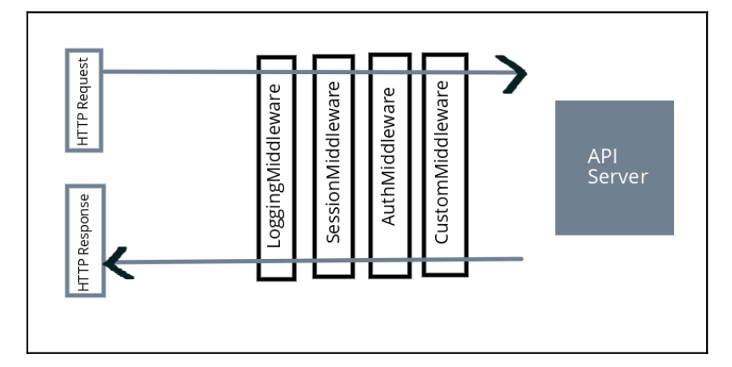

# Middleware and RPC

## Topics

- What is middleware?
- What is an RPC (Remote Procedure Call)?
- How can we implement RPC and JSON RPC in Go?

## What is middleware?

Middleware is an entity that hooks into a server's request/response processing. The middleware can be defined in many components. Each component has a specific function to
perform. Whenever we define the handlers for our URL patterns the request hits the handler and executes the business logic. So virtually all middleware should perform these functions in order:

1. Process the request before hitting the handler (function)
2. Process the handler function.
3. Process the response before giving it to the client

## We can see the previous points in the form of a visual illustration:

